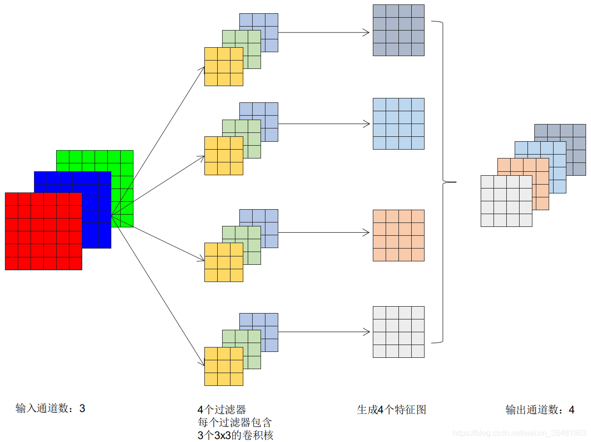

## CNN基础知识

* 对于最初输入图片样本的通道数 in_channels 取决于图片的类型，如果是彩色的，即RGB类型，这时候通道数固定为3，如果是灰色的，通道数为1。
* 卷积完成之后，输出的通道数 out_channels 取决于过滤器的数量。从这个方向理解，这里的 out_channels 设置的就是过滤器的数目。
* 对于第二层或者更多层的卷积，此时的 in_channels 就是上一层的 out_channels ， out_channels 还是取决于过滤器数目。

增加通道数可以提取更多的特征，从而提高模型的表达能力。例如，不同的卷积核可以提取不同的特征，如边缘、纹理等。通过增加卷积核的数量，可以生成更多的特征图，有助于模型更好地学习和识别图像中的信息

