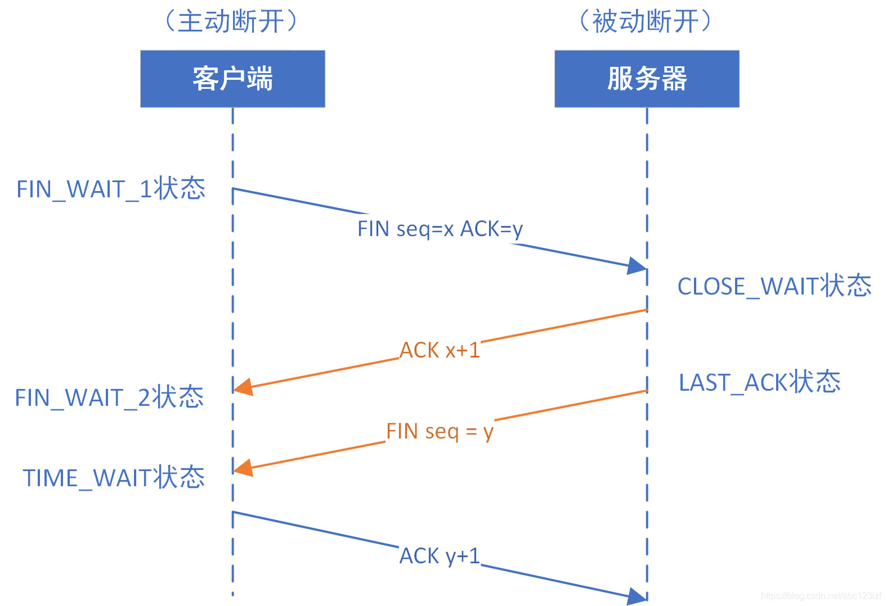

# 计算机网络

## 物理层

物理层的作用：连接不同的物理设备，传输比特流。该层为上层协议提供了一个传输数据的可靠的物理媒体。简单的说，物理层确保原始的数据可在各种物理媒体上传输。

## 数据链路层

数据链路层在物理层提供的服务的基础上向网络层提供服务，其最基本的服务是将源自网络层来的数据可靠地传输到相邻节点的目标机网络层。数据链路层在不可靠的物理介质上提供可靠的传输。

## 网络层

网络层的目的是实现两个端系统之间的数据透明传送，具体功能包括寻址和路由选择、连接的建立、保持和终止等。数据交换技术是报文交换（基本上被分组所替代）：采用储存转发方式，数据交换单位是报文。

### IP协议
IP协议（Internet Protocol）是TCP/IP协议族中的核心协议，它负责在异构网络间传输数据包。IP协议的设计目标是提高网络的可扩展性，解决互联网问题，实现大规模、异构网络的互联互通，并分割顶层网络应用和底层网络技术之间的耦合关系，以利于两者的独立发展

IP协议的主要功能：

IP协议的主要功能包括两个方面：数据传输和数据分片。数据传输是指IP协议根据IP地址将数据包传输到指定的目标主机，类似于邮递过程中根据地址投递包裹。数据分片则是指当数据包超过网络的最大传输单元（MTU）时，IP协议会将数据包分割成多个较小的片段，这些片段在到达目标主机后会被重新组合

IP地址分类：

IP地址是32位的二进制数，通常以点分十进制形式表示。IP地址分为A、B、C、D、E五类，其中A、B、C类地址用于一般的网络连接，D类地址用于组播，E类地址保留未用。每个IP地址由网络号和主机号两部分组成，同一物理网络上的所有主机共享同一网络号

    A 类 0.0.0.0 到 127.255.255.255
    B 类 128.0.0.0 到 191.255.255.255
    C 类 192.0.0.0 到 223.255.255.255
    D 类 224.0.0.0 到 239.255.255.255
    E 类 240.0.0.0 到 247.255.255.255

IP数据包分片：

由于不同网络可能有不同的MTU限制，IP协议在发送数据包时会选择一个合适的初始长度。如果数据包的长度超过了某个网络的MTU，则会在路由器上进行分片，将数据包分割成多个小片段后再发送。这些片段在目的主机处会被重组成原始数据包

## 传输层

第一个端到端，即主机到主机的层次。传输层负责将上层数据分段并提供端到端的、可靠的或不可靠的传输。
此外，传输层还要处理端到端的差错控制和流量控制问题。 传输层的任务是根据通信子网的特性，最佳的利用网络资源，为两个端系统的会话层之间，提供建立、维护和取消传输连接的功能，负责端到端的可靠数据传输。
在这一层，信息传送的协议数据单元称为段或报文。 网络层只是根据网络地址将源结点发出的数据包传送到目的结点，而传输层则负责将数据可靠地传送到相应的端口。
### UDP
1. 无连接：只知道对端的IP和端口号就可以发送，不需要实现建立连接。
2. 不可靠：没有确认机制， 没有重传机制。如果因为网络故障该段无法发到对方， UDP协议层也不会给应用层返回任何错误信息。
3. 面向数据报： 应用层交给UDP多长的报文， UDP原样发送既不会拆分，也不会合并。如果发送端调用一次sendto, 发送100个字节, 那么接收端也必须调用对应的一次recvfrom, 接收100个 字节，而不能循环调用10次recvfrom, 每次接收10个字节。所以UDP不能够灵活的控制读写数据的次数和数量。

UDP的缓冲区：UDP存在接收缓冲区，但不存在发送缓冲区。

UDP没有发送缓冲区，在调用sendto时会直接将数据交给内核，由内核将数据传给网络层协议进行后续的传输动作。

UDP不保证可靠性，它没有重传机制，当报文丢失时，UDP不需要重新发送，而TCP不同，他必须具备发送缓冲区，当报文丢失时，TCP必须保证重新发送，用户不会管，所以必须要具备发送缓冲区。

UDP具有接收缓冲区，但是这个接收缓冲区不能保证收到的UDP报文的顺序和发送UDP报的顺序一致，如果缓冲区满了再到达的UDP数据报就会被丢弃。

UDP是一种全双工通信协议。 UDP协议首部中有一个16位的大长度. 也就是说一个UDP能传输的报文长度是64K(包含UDP首部)。如果我们需要传输的数据超过64K, 就需要在应用层手动的分包, 多次发送, 并在接收端手动拼装。

### TCP
TCP协议作为传输层协议，它在网络层IP协议不可靠的尽力而为服务至上提供了一个可靠数据传输服务。TCP协议的数据传输确保了其上层协议读出的数据是无损坏、无间隔、按序、非冗余的二进制流。

TCP是面向连接的，在两个进程通过TCP协议发送数据时，必须先要经过互相“握手”，来建立确保数据传输的参数。TCP连接不是在电路交换网络中的端到端TDM或者FDM电路，也不是构建在网络层上的虚电路，所以中间的网络元素并不会维持TCP的连接状态，对于路由器而言，它们所看到的只是一个IP数据报文，而不是连接。

TCP连接提供全双工服务，也就是说进程A与进程B存在一条TCP连接时，在同一时间内，它们都是可以互相发送数据的。并且，TCP是一个点对点数据传输的协议，即不支持多播。

TCP连接的建立需要经历三次握手的过程：

TCP连接的解除需要经历四次挥手过程：

FIN报文就代表自己的数据已经发送完毕了，但这个时候还是可以接收来自对方的数据的。当对方也没有数据要发送时，也需要主动发送一个FIN报文，然后再接收对方的ACK

TCP控制流量的方式是通过连接建立时产生的变量cwnd（拥塞窗口）来计算。

拥塞控制包含四个部分：**慢启动、拥塞避免、快速重传，快速恢复**

## 应用层

应用层直接和应用程序接口并提供常见的网络应用服务。应用层也向表示层发出请求。应用层是开放系统的最高层,是直接为应用进程提供服务的。其作用是在实现多个系统应用进程相互通信的同时,完成一系列业务处理所需的服务.其服务元素分为两类:公共应用服务元素CASE和特定应用服务元素SASE.

### DNS

DNS 全名叫 Domain Name Server，中文俗称“域名服务器”，在 Internet 上域名与 IP 地址之间是一一对应的，域名虽然便于人们记忆，但机器之间只能互相认识IP地址，它们之间的转换工作称为域名解析，域名解析需要由专门的域名解析服务器来完成，DNS 就是进行域名解析的服务器，将域名(机器名) 转换为 IP地址。

DNS 是一个分布式数据库，提供了主机名和 IP 地址之间相互转换的服务。这里的分布式数据库是指，每个站点只保留它自己的那部分数据。如果整个因特网都使用一个域名服务器，负荷太大， 所以 DNS 设计成一个分布式的数据库，即使单个主机出故障也不会妨碍整个 DNS 系统。另外 DNS 使得大多数域名都能在本地解析，仅少量解析需要在因特网上通信，因此 DNS 效率很高。

1. 根域名服务器：最高层次的域名服务器，根域名服务器知道所有顶级域名服务器的域名和IP地址。任何一个本地域名服务器要对互联网上的任何域名进行解析，只要自己无法解析，就会首先求助于根域名服务器。
2. 顶级域名服务器：管理在该顶级域名服务器下注册的所有二级域名。当收到DNS查询请求时，就给出相应的回答（可能是最后的结果，也可能是下一步需要去找的域名服务器的IP地址）。
3. 权限域名服务器（权威域名服务器）：负责一个区的域名服务器。当一个权威域名服务器不能给出最终的查询结果时，就会告诉发出请求方，下一步应该去找哪一个权威域名服务器。
4. 本地域名服务器（递归服务器）：主机发出 DNS 查询请求时，该请求首先会发给本地域名服务器。

DNS 占用 53 号端口，同时使用 TCP 和 UDP 协议。DNS 在进行区域传输的时候使用 TCP 协议，其它时候则使用 UDP 协议；

### http
HTTP 是 HyperText Transfer Protocol（超文本传输协议）的简写，它是 TCP/IP 协议集中的一个应用层协议，是客户端与服务端进行交互时必须遵循的规则。它用于定义 Web 浏览器与 Web 服务器之间交换数据的过程以及数据本身的格式，底层是靠 TCP 进行可靠地信息传输。

### https
HTTPS （全称：Hypertext Transfer Protocol Secure ），是以安全为目标的 HTTP 通道，在HTTP的基础上通过传输加密和身份认证保证了传输过程的安全性 。HTTPS 在HTTP 的基础下加入SSL，HTTPS 的安全基础是 SSL，因此加密的详细内容就需要 SSL。 HTTPS 存在不同于 HTTP 的默认端口及一个加密/身份验证层（在 HTTP与 TCP 之间）。这个系统提供了身份验证与加密通讯方法。它被广泛用于万维网上安全敏感的通讯，例如交易支付等方面 。

HTTPS不是协议，而是通过SSL/TLS协议提供的安全连接进行的HTTP通信。最初，它被用于安全很重要的通信，例如在互联网上传输个人信息和电子支付。

