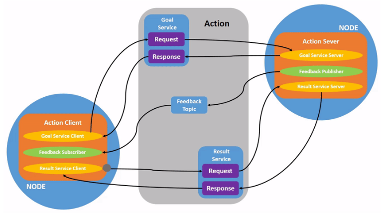

# ros


## 节点与节点管理器
**节点（Node）— 执行单元**

1. 节点是具体的执行单元，执行具体任务的进程，独立运行的可执行文件

2. 不同的节点可以使用不同的编程语言，可分布式运行在不同的主机

3. 节点在系统中的名称必须是唯一的，重名ros系统会找不到

**节点管理器（ROS Master) — 控制中心**

1. 节点的管理。命名、注册、建立通讯

2. 提供参数服务器，节点使用此服务器存储和检索运行时的参数

**话题通信（异步）**

话题 topic

1. 分为发布者和订阅者

2. 单向数据传输，从驱动端传到订阅段，发布者到订阅者

3. 通道被定义为话题，时数据传输的总线

**消息 message**

1. 具有一定的类型和数据结构（有ros提供的标准类型和用户自定义的类型

2. 使用与编程语言无关的 .msg 文件定义类型和数据结构

**服务通信（同步） 服务 service**

1. 使用客户端/服务器（service/client) 模型，客户端发送请求数据，服务器完成处理后返回应答数据

2. 使用与编程语言无关的, .srv 文件定义请求和应答的数据结构

3. 一般是一次，发出一个配置指令，完成配置内容，返回一个反馈

## ROS命令行工具
roscore启动ROS master(要首先运行的一个指令）

rqt_graph用来显示系统计算图的工具

rosnode list：列出系统当中使用的节点 ， rosout是ros默认的一个话题

rosnode info **： 查看某个节点的信息 ，发布和订阅的信息  rosnode info /turtlesim

rosmsg show显示消息的数据结构

rosservice list ：提供的所有服务 ，服务端都是仿真器 ，客户端是终端

rosbag record -a -O cmd_record：话题记录

rosbag play cmd_record.bag：话题复现

## 创建工作空间与功能包
工作空间（workspace)是一个存放工程开发相关文件的文件夹。所有的源码、配置文件、可执行文件都是放置在里面的。主要分为四个文件夹：
1. src: 代码空间 (source space)

放置功能包（里面的代码、配置文件、launch文件
2. build:编译空间 (build space)

编译过程中的中间文件（不太用关心
3. devel:开发空间 (development space)

编译生成的一些可执行文件、库、脚本
4. install:安装空间 (install space）

install命令的结果就放在里面


创建功能包：

```bash 
catkin_create_pkg test_pkg std_msgs rospy roscpp
```
## Publisher的编程实现


**必须注意，我们设置的node名称，发布的topic**

构建功能包：

在src目录下：

```bash
catkin_create_pkg learning_topic rospy roscpp std_msgs geometry_msgs turtlesim
```

```c++
#include <ros/ros.h>
#include <geometry_msgs/Twist.h>

int main(int argc, char **argv)
{
	// ROS节点初始化
	ros::init(argc, argv, "velocity_publisher");

	// 创建节点句柄
	ros::NodeHandle n;

	// 创建一个Publisher，发布名为/turtle1/cmd_vel的topic，消息类型为geometry_msgs::Twist，队列长度10
	ros::Publisher turtle_vel_pub = n.advertise<geometry_msgs::Twist>("/turtle1/cmd_vel", 10);

	// 设置循环的频率
	ros::Rate loop_rate(10);

	int count = 0;
	while (ros::ok())
	{
	    // 初始化geometry_msgs::Twist类型的消息
		geometry_msgs::Twist vel_msg;
		vel_msg.linear.x = 0.5;
		vel_msg.angular.z = 0.2;

	    // 发布消息
		turtle_vel_pub.publish(vel_msg);
		ROS_INFO("Publsh turtle velocity command[%0.2f m/s, %0.2f rad/s]", 
				vel_msg.linear.x, vel_msg.angular.z);

	    // 按照循环频率延时
	    loop_rate.sleep();
	}

	return 0;
}
```
其中python出现bug:

1. chmod +x  确保你的 Python 脚本是可执行的

2. 添加 Shebang（解释器声明）
首先，在 veo_publisher.py 文件的最顶部添加一行 shebang，告诉系统这是一个 Python 脚本。


```py
import rospy
from geometry_msgs.msg import Twist

def velocity_publisher():
	# ROS节点初始化
    rospy.init_node('velocity_publisher', anonymous=True)

	# 创建一个Publisher，发布名为/turtle1/cmd_vel的topic，消息类型为geometry_msgs::Twist，队列长度10
    turtle_vel_pub = rospy.Publisher('/turtle1/cmd_vel', Twist, queue_size=10)

	#设置循环的频率
    rate = rospy.Rate(10) 

    while not rospy.is_shutdown():
		# 初始化geometry_msgs::Twist类型的消息
        vel_msg = Twist()
        vel_msg.linear.x = 0.5
        vel_msg.angular.z = 0.2

		# 发布消息
        turtle_vel_pub.publish(vel_msg)
    	rospy.loginfo("Publsh turtle velocity command[%0.2f m/s, %0.2f rad/s]", 
				vel_msg.linear.x, vel_msg.angular.z)

		# 按照循环频率延时
        rate.sleep()

if __name__ == '__main__':
    try:
        velocity_publisher()
    except rospy.ROSInterruptException:
        pass
    
```
代码编译规则：


## subscriber：

```c++
#include <ros/ros.h>
#include "turtlesim/Pose.h"

// 接收到订阅的消息后，会进入消息回调函数
void poseCallback(const turtlesim::Pose::ConstPtr& msg)
{
    // 将接收到的消息打印出来
    ROS_INFO("Turtle pose: x:%0.6f, y:%0.6f", msg->x, msg->y);
}

int main(int argc, char **argv)
{
    // 初始化ROS节点
    ros::init(argc, argv, "pose_subscriber");

    // 创建节点句柄
    ros::NodeHandle n;

    // 创建一个Subscriber，订阅名为/turtle1/pose的topic，注册回调函数poseCallback
    ros::Subscriber pose_sub = n.subscribe("/turtle1/pose", 10, poseCallback);

    // 循环等待回调函数
    ros::spin();

    return 0;
}
```

```py
import rospy
from turtlesim.msg import Pose

def poseCallback(msg):
    rospy.loginfo("Turtle pose: x:%0.6f, y:%0.6f", msg.x, msg.y)

def pose_subscriber():
	# ROS节点初始化
    rospy.init_node('pose_subscriber', anonymous=True)

	# 创建一个Subscriber，订阅名为/turtle1/pose的topic，注册回调函数poseCallback
    rospy.Subscriber("/turtle1/pose", Pose, poseCallback)

	# 循环等待回调函数
    rospy.spin()

if __name__ == '__main__':
    pose_subscriber()

```


```c++
/**
 * 该例程设置/读取海龟例程中的参数
 */
#include <string>
#include <ros/ros.h>
#include <std_srvs/Empty.h>

int main(int argc, char **argv)
{
	int red, green, blue;

    // ROS节点初始化
    ros::init(argc, argv, "parameter_config");

    // 创建节点句柄
    ros::NodeHandle node;

    // 读取背景颜色参数
	ros::param::get("/background_r", red);
	ros::param::get("/background_g", green);
	ros::param::get("/background_b", blue);

	ROS_INFO("Get Backgroud Color[%d, %d, %d]", red, green, blue);

	// 设置背景颜色参数
	ros::param::set("/background_r", 255);
	ros::param::set("/background_g", 255);
	ros::param::set("/background_b", 255);

	ROS_INFO("Set Backgroud Color[255, 255, 255]");

    // 读取背景颜色参数
	ros::param::get("/background_r", red);
	ros::param::get("/background_g", green);
	ros::param::get("/background_b", blue);

	ROS_INFO("Re-get Backgroud Color[%d, %d, %d]", red, green, blue);

	// 调用服务，刷新背景颜色
	ros::service::waitForService("/clear");
	ros::ServiceClient clear_background = node.serviceClient<std_srvs::Empty>("/clear");
	std_srvs::Empty srv;
	clear_background.call(srv);
	
	sleep(1);

    return 0;
}

```

```py
#!/usr/bin/env python
# -*- coding: utf-8 -*-
import sys
import rospy
from std_srvs.srv import Empty

def parameter_config():
	# ROS节点初始化
    rospy.init_node('parameter_config', anonymous=True)

	# 读取背景颜色参数
    red   = rospy.get_param('/background_r')
    green = rospy.get_param('/background_g')
    blue  = rospy.get_param('/background_b')

    rospy.loginfo("Get Backgroud Color[%d, %d, %d]", red, green, blue)

	# 设置背景颜色参数
    rospy.set_param("/background_r", 255);
    rospy.set_param("/background_g", 255);
    rospy.set_param("/background_b", 255);

    rospy.loginfo("Set Backgroud Color[255, 255, 255]");

	# 读取背景颜色参数
    red   = rospy.get_param('/background_r')
    green = rospy.get_param('/background_g')
    blue  = rospy.get_param('/background_b')

    rospy.loginfo("Get Backgroud Color[%d, %d, %d]", red, green, blue)

	# 发现/spawn服务后，创建一个服务客户端，连接名为/spawn的service
    rospy.wait_for_service('/clear')
    try:
        clear_background = rospy.ServiceProxy('/clear', Empty)

		# 请求服务调用，输入请求数据
        response = clear_background()
        return response
    except rospy.ServiceException, e:
        print "Service call failed: %s"%e

if __name__ == "__main__":
    parameter_config()
```
## launch文件

通过launch文件以及roslaunch命令可以一次性启动多个节点，并且可以设置丰富的参数。

node标签会指定一个准备运行的ROS节点，node标签是 launch 文件中最重要的标签，因为它实现了launch文件的基本功能，即同时启动多个ROS节点。

```xml
<node pkg="package_name" type="executable_node" name="node_name" args="$()" respawn="true" output="sceen">

```
1. pkg：节点所在功能包的名称package_name；
2. type：节点类型是可执行文件(节点)的名称executable_node；
3. name：节点运行时的名称node_name；
4. args：传递命令行设置的参数；
5. respawn：是否自动重启，true表示如果节点未启动或异常关闭，则自动重启；false则表示不自动重启，默认值为false；
6. output：是否将节点信息输出到屏幕，如果不设置该属性，则节点信息会被写入到日志文件，并不会显示到屏幕上。


param:

param标签则可以实现传递参数的功能，它可以定义一个将要被设置到参数
服务器的参数，它的参数值可以通过文本文件、二进制文件或命令等属性来设置。

```xml
<param name="param_name" type="param_type" value="param_value" />
<!-- param 标签可以嵌入到 node 标签中，以此来作为该 node 的私有参数 -->
<node>
	<param name="param_name" type="param_type" value="param_value" />
</node>
```
1. name：参数名称param_name
2. type：参数类型double，str，int，bool，yaml
3. value：需要设置的参数值param_value

rosparam标签可以实现节点从参数服务器上加载(load)、导出(dump)和删除(delete)YAML文件

```xml
<!-- 加载package_name功能包下的example.yaml文件 -->
<rosparam command="load" file="$(find package_name)/example.yaml">
<!-- 导出example_out.yaml文件到package_name功能包下 -->
<rosparam command="dump" file="$(find package_name)/example_out.yaml" />
<!-- 删除参数 -->
<rosparam command="delete" param="xxx/param">
```

include标签功能和编程语言中的include预处理类似，它可以导入其他launch文件到当前include标签所在的位置，实现launch文件复用。

```xml
<include file="$(find package_name)/launch_file_name">

```
remap标签可以实现节点名称的重映射，每个remap标签包含一个原始名称和一个新名称，在系统运行后原始名称会被替换为新名称。

```xml
<arg name="arg_name" default="arg_default" />
<arg name="arg_name" value="arg_value" />
<!-- 命令行传递的 arg 参数可以覆盖 default，但不能覆盖 value。 -->
```


```xml
<arg name="arg_name" default="arg_default" />
<arg name="arg_name" value="arg_value" />
<!-- 命令行传递的 arg 参数可以覆盖 default，但不能覆盖 value。 -->

```
* arg	启动时的参数，只在launch文件中有意义
* param	运行时的参数，参数会存储在参数服务器中

group标签可以实现将一组配置应用到组内的所有节点，它也具有命名空间ns特点，可以将不同的节点放入不同的 namespace。
```xml

<!-- 用法1 -->
<group ns="namespace_1">
    <node pkg="pkg_name1" .../>
    <node pkg="pkg_name2" .../>
    ...
</group>

<group ns="namespace_2">
    <node pkg="pkg_name3" .../>
    <node pkg="pkg_name4" .../>
    ...
</group>
<!-- 用法2 -->
<!-- if = value：value 为 true 则包含内部信息 -->
<group if="$(arg foo1)">
    <node pkg="pkg_name1" .../>
</group>

<!-- unless = value：value 为 false 则包含内部信息 -->
<group unless="$(arg foo2)">
    <node pkg="pkg_name2" .../>
</group>
<!--
	当 foo1 == true 时包含其标签内部
	当 foo2 == false 时包含其标签内部
-->
```

# ros2

其中主要知识在：
<a href="https://book.guyuehome.com/">ros2使用</a>

## 功能包与节点：

在ROS2中创建一个功能包

```bash
ros2 pkg create --build-type <build-type> <package_name>
```
ros2命令中：

1. pkg：表示功能包相关的功能；
2. create：表示创建功能包；
3. build-type：表示新创建的功能包是C++还是Python的，如果使用C++或者C，那这里就跟
ament_cmake，如果使用Python，就跟ament_python；
4. package_name：新建功能包的名字。

```bash
cd ~/dev_ws/src
ros2 pkg create --build-type ament_cmake learning_pkg_c               # C++
ros2 pkg create --build-type ament_python learning_pkg_python # Python
```

* 节点在机器人系统中的职责就是执行某些具体的任务，从计算机操作系统的角度来看，也叫做进程；

* 这些节点是功能各不相同的细胞，根据系统设计的不同，可能位于计算机A，也可能位于计算机B，还有可能运行在云端，这叫做分布式，也就是可以分布在不同的硬件载体上；

* 每一个节点都需要有唯一的命名，当我们想要去找到某一个节点的时候，或者想要查询某一个节点的状态时，可以通过节点的名称来做查询。

```py
#!/usr/bin/env python3 
# -*- coding: utf-8 -*-

"""
@说明: ROS2节点示例-发布“Hello World”日志信息, 使用面向过程的实现方式
"""

import rclpy                                   # ROS2 Python接口库
from rclpy.node import Node                    # ROS2 节点类
import time

def main(args=None):                           # ROS2节点主入口main函数
    rclpy.init(args=args)                      # ROS2 Python接口初始化
    node = Node("node_helloworld")             # 创建ROS2节点对象并进行初始化

    while rclpy.ok():                          # ROS2系统是否正常运行
        node.get_logger().info("Hello World")  # ROS2日志输出
        time.sleep(0.5)                        # 休眠控制循环时间

    node.destroy_node()                        # 销毁节点对象    
    rclpy.shutdown()                           # 关闭ROS2 Python接口
```

完成代码的编写后需要设置功能包的编译选项，让系统知道Python程序的入口，打开功能包的setup.py文件，加入如下入口点的配置：

```py
    entry_points={
        'console_scripts': [
         'node_helloworld       = learning_node.node_helloworld:main',
        ],
    }
```

```py
#!/usr/bin/env python3
# -*- coding: utf-8 -*-

"""

@说明: ROS2节点示例-发布“Hello World”日志信息, 使用面向对象的实现方式
"""

import rclpy                                     # ROS2 Python接口库
from rclpy.node import Node                      # ROS2 节点类
import time

"""
创建一个HelloWorld节点, 初始化时输出“hello world”日志
"""
class HelloWorldNode(Node):
    def __init__(self, name):
        super().__init__(name)                     # ROS2节点父类初始化
        while rclpy.ok():                          # ROS2系统是否正常运行
            self.get_logger().info("Hello World")  # ROS2日志输出
            time.sleep(0.5)                        # 休眠控制循环时间

def main(args=None):                               # ROS2节点主入口main函数
    rclpy.init(args=args)                          # ROS2 Python接口初始化
    node = HelloWorldNode("node_helloworld_class") # 创建ROS2节点对象并进行初始化
    rclpy.spin(node)                               # 循环等待ROS2退出
    node.destroy_node()                            # 销毁节点对象
    rclpy.shutdown()                               # 关闭ROS2 Python接口
```

```bash
ros2 run learning_node node_object
```

```py
#!/usr/bin/env python3 
# -*- coding: utf-8 -*-

"""
@说明: ROS2节点示例-通过颜色识别检测图片中出现的苹果
"""

import rclpy                            # ROS2 Python接口库
from rclpy.node import Node             # ROS2 节点类

import cv2                              # OpenCV图像处理库
import numpy as np                      # Python数值计算库

lower_red = np.array([0, 90, 128])     # 红色的HSV阈值下限
upper_red = np.array([180, 255, 255])  # 红色的HSV阈值上限

def object_detect(image):
    hsv_img = cv2.cvtColor(image, cv2.COLOR_BGR2HSV)      # 图像从BGR颜色模型转换为HSV模型
    mask_red = cv2.inRange(hsv_img, lower_red, upper_red) # 图像二值化

    contours, hierarchy = cv2.findContours(mask_red, cv2.RETR_LIST, cv2.CHAIN_APPROX_NONE) # 图像中轮廓检测

    for cnt in contours:                                  # 去除一些轮廓面积太小的噪声
        if cnt.shape[0] < 150:
            continue

        (x, y, w, h) = cv2.boundingRect(cnt)              # 得到苹果所在轮廓的左上角xy像素坐标及轮廓范围的宽和高
        cv2.drawContours(image, [cnt], -1, (0, 255, 0), 2)# 将苹果的轮廓勾勒出来
        cv2.circle(image, (int(x+w/2), int(y+h/2)), 5, (0, 255, 0), -1)# 将苹果的图像中心点画出来

    cv2.imshow("object", image)                           # 使用OpenCV显示处理后的图像效果
    cv2.waitKey(0)
    cv2.destroyAllWindows()

def main(args=None):                                      # ROS2节点主入口main函数
    rclpy.init(args=args)                                 # ROS2 Python接口初始化
    node = Node("node_object")                            # 创建ROS2节点对象并进行初始化
    node.get_logger().info("ROS2节点示例：检测图片中的苹果")

    image = cv2.imread('/home/hcx/dev_ws/src/ros2_21_tutorials/learning_node/learning_node/apple.jpg')  # 读取图像
    object_detect(image)                                   # 苹果检测
    rclpy.spin(node)                                       # 循环等待ROS2退出
    node.destroy_node()                                    # 销毁节点对象
    rclpy.shutdown()                                       # 关闭ROS2 Python接口
```

```bash
ros2 node list               # 查看节点列表
ros2 node info <node_name>   # 查看节点信息
```

## 话题：
```py
#!/usr/bin/env python3
# -*- coding: utf-8 -*-

"""
@说明: ROS2话题示例-发布“Hello World”话题
"""

import rclpy                                     # ROS2 Python接口库
from rclpy.node import Node                      # ROS2 节点类
from std_msgs.msg import String                  # 字符串消息类型

"""
创建一个发布者节点
"""
class PublisherNode(Node):

    def __init__(self, name):
        super().__init__(name)                                    # ROS2节点父类初始化
        self.pub = self.create_publisher(String, "chatter", 10)   # 创建发布者对象（消息类型、话题名、队列长度）
        self.timer = self.create_timer(0.5, self.timer_callback)  # 创建一个定时器（单位为秒的周期，定时执行的回调函数）

    def timer_callback(self):                                     # 创建定时器周期执行的回调函数
        msg = String()                                            # 创建一个String类型的消息对象
        msg.data = 'Hello World'                                  # 填充消息对象中的消息数据
        self.pub.publish(msg)                                     # 发布话题消息
        self.get_logger().info('Publishing: "%s"' % msg.data)     # 输出日志信息，提示已经完成话题发布

def main(args=None):                                 # ROS2节点主入口main函数
    rclpy.init(args=args)                            # ROS2 Python接口初始化
    node = PublisherNode("topic_helloworld_pub")     # 创建ROS2节点对象并进行初始化
    rclpy.spin(node)                                 # 循环等待ROS2退出
    node.destroy_node()                              # 销毁节点对象
    rclpy.shutdown()                                 # 关闭ROS2 Python接口
```

```py
#!/usr/bin/env python3
# -*- coding: utf-8 -*-

"""
@说明: ROS2话题示例-订阅“Hello World”话题消息
"""

import rclpy                      # ROS2 Python接口库
from rclpy.node   import Node     # ROS2 节点类
from std_msgs.msg import String   # ROS2标准定义的String消息

"""
创建一个订阅者节点
"""
class SubscriberNode(Node):

    def __init__(self, name):
        super().__init__(name)                             # ROS2节点父类初始化
        self.sub = self.create_subscription(\
            String, "chatter", self.listener_callback, 10) # 创建订阅者对象（消息类型、话题名、订阅者回调函数、队列长度）

    def listener_callback(self, msg):                      # 创建回调函数，执行收到话题消息后对数据的处理
        self.get_logger().info('I heard: "%s"' % msg.data) # 输出日志信息，提示订阅收到的话题消息

def main(args=None):                               # ROS2节点主入口main函数
    rclpy.init(args=args)                          # ROS2 Python接口初始化
    node = SubscriberNode("topic_helloworld_sub")  # 创建ROS2节点对象并进行初始化
    rclpy.spin(node)                               # 循环等待ROS2退出
    node.destroy_node()                            # 销毁节点对象
    rclpy.shutdown()                               # 关闭ROS2 Python接口
```

## 服务：
```py
#!/usr/bin/env python3
# -*- coding: utf-8 -*-

"""
@说明: ROS2服务示例-发送两个加数，请求加法器计算
"""

import sys

import rclpy                                  # ROS2 Python接口库
from rclpy.node   import Node                 # ROS2 节点类
from learning_interface.srv import AddTwoInts # 自定义的服务接口

class adderClient(Node):
    def __init__(self, name):
        super().__init__(name)                                       # ROS2节点父类初始化
        self.client = self.create_client(AddTwoInts, 'add_two_ints') # 创建服务客户端对象（服务接口类型，服务名）
        while not self.client.wait_for_service(timeout_sec=1.0):     # 循环等待服务器端成功启动
            self.get_logger().info('service not available, waiting again...') 
        self.request = AddTwoInts.Request()                          # 创建服务请求的数据对象

    def send_request(self):                                          # 创建一个发送服务请求的函数
        self.request.a = int(sys.argv[1])
        self.request.b = int(sys.argv[2])
        self.future = self.client.call_async(self.request)           # 异步方式发送服务请求

def main(args=None):
    rclpy.init(args=args)                        # ROS2 Python接口初始化
    node = adderClient("service_adder_client")   # 创建ROS2节点对象并进行初始化
    node.send_request()                          # 发送服务请求

    while rclpy.ok():                            # ROS2系统正常运行
        rclpy.spin_once(node)                    # 循环执行一次节点

        if node.future.done():                   # 数据是否处理完成
            try:
                response = node.future.result()  # 接收服务器端的反馈数据
            except Exception as e:
                node.get_logger().info(
                    'Service call failed %r' % (e,))
            else:
                node.get_logger().info(          # 将收到的反馈信息打印输出
                    'Result of add_two_ints: for %d + %d = %d' % 
                    (node.request.a, node.request.b, response.sum))
            break

    node.destroy_node()                          # 销毁节点对象
    rclpy.shutdown()                             # 关闭ROS2 Python接口
```

```py
#!/usr/bin/env python3
# -*- coding: utf-8 -*-

"""

@说明: ROS2服务示例-提供加法器的服务器处理功能
"""

import rclpy                                     # ROS2 Python接口库
from rclpy.node   import Node                    # ROS2 节点类
from learning_interface.srv import AddTwoInts    # 自定义的服务接口

class adderServer(Node):
    def __init__(self, name):
        super().__init__(name)                                                           # ROS2节点父类初始化
        self.srv = self.create_service(AddTwoInts, 'add_two_ints', self.adder_callback)  # 创建服务器对象（接口类型、服务名、服务器回调函数）

    def adder_callback(self, request, response):   # 创建回调函数，执行收到请求后对数据的处理
        response.sum = request.a + request.b       # 完成加法求和计算，将结果放到反馈的数据中
        self.get_logger().info('Incoming request\na: %d b: %d' % (request.a, request.b))   # 输出日志信息，提示已经完成加法求和计算
        return response                          # 反馈应答信息

def main(args=None):                             # ROS2节点主入口main函数
    rclpy.init(args=args)                        # ROS2 Python接口初始化
    node = adderServer("service_adder_server")   # 创建ROS2节点对象并进行初始化
    rclpy.spin(node)                             # 循环等待ROS2退出
    node.destroy_node()                          # 销毁节点对象
    rclpy.shutdown()                             # 关闭ROS2 Python接口
```

## 接口：
* 话题通信接口的定义使用的是.msg文件，由于是单向传输，只需要描述传输的每一帧数据是什么就行，比如在这个定义里，会传输两个32位的整型数，x、y，我们可以用来传输二维坐标的数值。

* 服务通信接口的定义使用的是.srv文件，包含请求和应答两部分定义，通过中间的“---”区分，比如之前我们学习的加法求和功能，请求数据是两个64位整型数a和b，应答是求和的结果sum。

* 动作是另外一种通信机制，用来描述机器人的一个运动过程，使用.action文件定义，比如我们让小海龟转90度，一边转一边周期反馈当前的状态，此时接口的定义分成了三个部分，分别是动作的目标，比如是开始运动，运动的结果，最终旋转的90度是否完成，还有一个周期反馈，比如每隔1s反馈一下当前转到第10度、20度还是30度了，让我们知道运动的进度。

## 动作：


客户端发送一个运动的目标，想让机器人动起来，服务器端收到之后，就开始控制机器人运动，一边运动，一边反馈当前的状态，如果是一个导航动作，这个反馈可能是当前所处的坐标，如果是机械臂抓取，这个反馈可能又是机械臂的实时姿态。当运动执行结束后，服务器再反馈一个动作结束的信息。整个通信过程就此结束。

接口定义

例程使用的动作并不是ROS中的标准定义，我们通过MoveCircle.action进行自定义：


```
bool enable     # 定义动作的目标，表示动作开始的指令
---
bool finish     # 定义动作的结果，表示是否成功执行
---
int32 state     # 定义动作的反馈，表示当前执行到的位置
```
包含三个部分：

第一块是动作的目标，enable为true时，表示开始运动；

第二块是动作的执行结果，finish为true，表示动作执行完成；

第三块是动作的周期反馈，表示当前机器人旋转到的角度。

完成定义后，还需要在功能包的CMakeLists.txt中配置编译选项，让编译器在编译过程中，根据接口定义，自动生成不同语言的代码：


```c++

find_package(rosidl_default_generators REQUIRED)

rosidl_generate_interfaces(${PROJECT_NAME}
  "action/MoveCircle.action"
)
```

```py
#!/usr/bin/env python3
# -*- coding: utf-8 -*-

"""
@说明: ROS2动作示例-负责执行圆周运动动作的服务端
"""

import time

import rclpy                                      # ROS2 Python接口库
from rclpy.node   import Node                     # ROS2 节点类
from rclpy.action import ActionServer             # ROS2 动作服务器类
from learning_interface.action import MoveCircle  # 自定义的圆周运动接口

class MoveCircleActionServer(Node):
    def __init__(self, name):
        super().__init__(name)                   # ROS2节点父类初始化
        self._action_server = ActionServer(      # 创建动作服务器（接口类型、动作名、回调函数）
            self,
            MoveCircle,
            'move_circle',
            self.execute_callback)

    def execute_callback(self, goal_handle):            # 执行收到动作目标之后的处理函数
        self.get_logger().info('Moving circle...')
        feedback_msg = MoveCircle.Feedback()            # 创建一个动作反馈信息的消息

        for i in range(0, 360, 30):                     # 从0到360度，执行圆周运动，并周期反馈信息
            feedback_msg.state = i                      # 创建反馈信息，表示当前执行到的角度
            self.get_logger().info('Publishing feedback: %d' % feedback_msg.state)
            goal_handle.publish_feedback(feedback_msg)  # 发布反馈信息
            time.sleep(0.5)

        goal_handle.succeed()                           # 动作执行成功
        result = MoveCircle.Result()                    # 创建结果消息
        result.finish = True                            
        return result                                   # 反馈最终动作执行的结果

def main(args=None):                                    # ROS2节点主入口main函数
    rclpy.init(args=args)                               # ROS2 Python接口初始化
    node = MoveCircleActionServer("action_move_server") # 创建ROS2节点对象并进行初始化
    rclpy.spin(node)                                    # 循环等待ROS2退出
    node.destroy_node()                                 # 销毁节点对象
    rclpy.shutdown()                                    # 关闭ROS2 Python接口
```

```py
#!/usr/bin/env python3
# -*- coding: utf-8 -*-

"""
@说明: ROS2动作示例-请求执行圆周运动动作的客户端
"""

import rclpy                                      # ROS2 Python接口库
from rclpy.node   import Node                     # ROS2 节点类
from rclpy.action import ActionClient             # ROS2 动作客户端类

from learning_interface.action import MoveCircle  # 自定义的圆周运动接口

class MoveCircleActionClient(Node):
    def __init__(self, name):
        super().__init__(name)                   # ROS2节点父类初始化
        self._action_client = ActionClient(      # 创建动作客户端（接口类型、动作名）
            self, MoveCircle, 'move_circle') 

    def send_goal(self, enable):                 # 创建一个发送动作目标的函数
        goal_msg = MoveCircle.Goal()             # 创建一个动作目标的消息
        goal_msg.enable = enable                 # 设置动作目标为使能，希望机器人开始运动

        self._action_client.wait_for_server()    # 等待动作的服务器端启动
        self._send_goal_future = self._action_client.send_goal_async(   # 异步方式发送动作的目标
            goal_msg,                                                   # 动作目标
            feedback_callback=self.feedback_callback)                   # 处理周期反馈消息的回调函数

        self._send_goal_future.add_done_callback(self.goal_response_callback) # 设置一个服务器收到目标之后反馈时的回调函数

    def goal_response_callback(self, future):           # 创建一个服务器收到目标之后反馈时的回调函数
        goal_handle = future.result()                   # 接收动作的结果
        if not goal_handle.accepted:                    # 如果动作被拒绝执行
            self.get_logger().info('Goal rejected :(')
            return

        self.get_logger().info('Goal accepted :)')                            # 动作被顺利执行

        self._get_result_future = goal_handle.get_result_async()              # 异步获取动作最终执行的结果反馈
        self._get_result_future.add_done_callback(self.get_result_callback)   # 设置一个收到最终结果的回调函数 

    def get_result_callback(self, future):                                    # 创建一个收到最终结果的回调函数
        result = future.result().result                                       # 读取动作执行的结果
        self.get_logger().info('Result: {%d}' % result.finish)                # 日志输出执行结果

    def feedback_callback(self, feedback_msg):                                # 创建处理周期反馈消息的回调函数
        feedback = feedback_msg.feedback                                      # 读取反馈的数据
        self.get_logger().info('Received feedback: {%d}' % feedback.state) 

def main(args=None):                                       # ROS2节点主入口main函数
    rclpy.init(args=args)                                  # ROS2 Python接口初始化
    node = MoveCircleActionClient("action_move_client")    # 创建ROS2节点对象并进行初始化
    node.send_goal(True)                                   # 发送动作目标
    rclpy.spin(node)                                       # 循环等待ROS2退出
    node.destroy_node()                                    # 销毁节点对象
    rclpy.shutdown()                                       # 关闭ROS2 Python接口
```

## 参数与分布式系统：

ROS系统中，机器人功能是由各种节点组成的，这些节点可能位于不同的计算机中，这种结构可以将原本资源消耗较多的任务，分配到不同的平台上，减轻计算压力，这就是分布式通信框架的典型应用之一。

```bash
ros2 param list

ros2 param describe turtlesim background_b   # 查看某个参数的描述信息
ros2 param get turtlesim background_b        # 查询某个参数的值
ros2 param set turtlesim background_b 10     # 修改某个参数的值


ros2 param dump turtlesim >> turtlesim.yaml  # 将某个节点的参数保存到参数文件中
ros2 param load turtlesim turtlesim.yaml     # 一次性加载某一个文件中的所有参数
```

```py
#!/usr/bin/env python3
# -*- coding: utf-8 -*-

"""
@说明: ROS2参数示例-创建、读取、修改参数
"""

import rclpy                                     # ROS2 Python接口库
from rclpy.node   import Node                    # ROS2 节点类

class ParameterNode(Node):
    def __init__(self, name):
        super().__init__(name)                                    # ROS2节点父类初始化
        self.timer = self.create_timer(2, self.timer_callback)    # 创建一个定时器（单位为秒的周期，定时执行的回调函数）
        self.declare_parameter('robot_name', 'mbot')              # 创建一个参数，并设置参数的默认值

    def timer_callback(self):                                      # 创建定时器周期执行的回调函数
        robot_name_param = self.get_parameter('robot_name').get_parameter_value().string_value   # 从ROS2系统中读取参数的值

        self.get_logger().info('Hello %s!' % robot_name_param)     # 输出日志信息，打印读取到的参数值

        new_name_param = rclpy.parameter.Parameter('robot_name',   # 重新将参数值设置为指定值
                            rclpy.Parameter.Type.STRING, 'mbot')
        all_new_parameters = [new_name_param]
        self.set_parameters(all_new_parameters)                    # 将重新创建的参数列表发送给ROS2系统

def main(args=None):                                 # ROS2节点主入口main函数
    rclpy.init(args=args)                            # ROS2 Python接口初始化
    node = ParameterNode("param_declare")            # 创建ROS2节点对象并进行初始化
    rclpy.spin(node)                                 # 循环等待ROS2退出
    node.destroy_node()                              # 销毁节点对象
    rclpy.shutdown()                                 # 关闭ROS2 Python接口
```
完成代码的编写后需要设置功能包的编译选项，让系统知道Python程序的入口

## 通信模型:
第一种，点对点模型，许多客户端连接到一个服务端，每次通信时，通信双方必须建立一条连接。当通信节点增多时，连接数也会增多。而且每个客户端都需要知道服务器的具体地址和所提供的服务，一旦服务器地址发生变化，所有客户端都会受到影响。

第二种，Broker模型，针对点对点模型进行了优化，由Broker集中处理所有人的请求，并进一步找到真正能响应该服务的角色。这样客户端就不用关心服务器的具体地址了。不过问题也很明显，Broker作为核心，它的处理速度会影响所有节点的效率，当系统规模增长到一定程度，Broker就会成为整个系统的性能瓶颈。更麻烦是，如果Broker发生异常，可能导致整个系统都无法正常运转。之前的ROS1系统，使用的就是类似这样的架构。

第三种，广播模型，所有节点都可以在通道上广播消息，并且节点都可以收到消息。这个模型解决了服务器地址的问题，而且通信双方也不用单独建立连接，但是广播通道上的消息太多了，所有节点都必须关心每条消息，其实很多是和自己没有关系的。

第四种，就是以数据为中心的DDS模型了，这种模型与广播模型有些类似，所有节点都可以在DataBus上发布和订阅消息。但它的先进之处在于，通信中包含了很多并行的通路，每个节点可以只关心自己感兴趣的消息，忽略不感兴趣的消息，有点像是一个旋转火锅，各种好吃的都在这个DataBus传送，我们只需要拿自己想吃的就行，其他的和我们没有关系。


QoS是一种网络传输策略，应用程序指定所需要的网络传输质量行为，QoS服务实现这种行为要求，尽可能地满足客户对通信质量的需求，可以理解为数据提供者和接收者之间的合约。

1. DEADLINE策略，表示通信数据必须要在每次截止时间内完成一次通信；
2. HISTORY策略，表示针对历史数据的一个缓存大小；
3. RELIABILITY策略，表示数据通信的模式，配置成BEST_EFFORT，就是尽力传输模式，网络情况不好的时候，也要保证数据流畅，此时可能会导致数据丢失，配置成RELIABLE，就是可信赖模式，可以在通信中尽量保证图像的完整性，我们可以根据应用功能场景选择合适的通信模式；
4. DURABILITY策略，可以配置针对晚加入的节点，也保证有一定的历史数据发送过去，可以让新节点快速适应系统。

```py
#!/usr/bin/env python3
# -*- coding: utf-8 -*-

"""
@说明: ROS2 QoS示例-发布“Hello World”话题
"""

import rclpy                     # ROS2 Python接口库
from rclpy.node import Node      # ROS2 节点类
from std_msgs.msg import String  # 字符串消息类型
from rclpy.qos import QoSProfile, QoSReliabilityPolicy, QoSHistoryPolicy # ROS2 QoS类

"""
创建一个发布者节点
"""
class PublisherNode(Node):

    def __init__(self, name):
        super().__init__(name)        # ROS2节点父类初始化

        qos_profile = QoSProfile(     # 创建一个QoS原则
            # reliability=QoSReliabilityPolicy.BEST_EFFORT,
            reliability=QoSReliabilityPolicy.RELIABLE,
            history=QoSHistoryPolicy.KEEP_LAST,
            depth=1
        )
        self.pub = self.create_publisher(String, "chatter", qos_profile) # 创建发布者对象（消息类型、话题名、QoS原则）
        self.timer = self.create_timer(0.5, self.timer_callback)         # 创建一个定时器（单位为秒的周期，定时执行的回调函数）

    def timer_callback(self):                                # 创建定时器周期执行的回调函数
        msg = String()                                       # 创建一个String类型的消息对象
        msg.data = 'Hello World'                             # 填充消息对象中的消息数据
        self.pub.publish(msg)                                # 发布话题消息
        self.get_logger().info('Publishing: "%s"' % msg.data)# 输出日志信息，提示已经完成话题发布

def main(args=None):                           # ROS2节点主入口main函数
    rclpy.init(args=args)                      # ROS2 Python接口初始化
    node = PublisherNode("qos_helloworld_pub") # 创建ROS2节点对象并进行初始化
    rclpy.spin(node)                           # 循环等待ROS2退出
    node.destroy_node()                        # 销毁节点对象
    rclpy.shutdown()                           # 关闭ROS2 Python接口
```

```py
#!/usr/bin/env python3
# -*- coding: utf-8 -*-

"""
@说明: ROS2 QoS示例-订阅“Hello World”话题消息
"""

import rclpy                                     # ROS2 Python接口库
from rclpy.node   import Node                    # ROS2 节点类
from std_msgs.msg import String                  # ROS2标准定义的String消息
from rclpy.qos import QoSProfile, QoSReliabilityPolicy, QoSHistoryPolicy  # ROS2 QoS类

"""
创建一个订阅者节点
"""
class SubscriberNode(Node):

    def __init__(self, name):
        super().__init__(name)         # ROS2节点父类初始化

        qos_profile = QoSProfile(      # 创建一个QoS原则
            # reliability=QoSReliabilityPolicy.BEST_EFFORT,
            reliability=QoSReliabilityPolicy.RELIABLE,
            history=QoSHistoryPolicy.KEEP_LAST,
            depth=1
        )

        self.sub = self.create_subscription(\
            String, "chatter", self.listener_callback, qos_profile) # 创建订阅者对象（消息类型、话题名、订阅者回调函数、QoS原则）

    def listener_callback(self, msg):                      # 创建回调函数，执行收到话题消息后对数据的处理
        self.get_logger().info('I heard: "%s"' % msg.data) # 输出日志信息，提示订阅收到的话题消息

def main(args=None):                               # ROS2节点主入口main函数
    rclpy.init(args=args)                          # ROS2 Python接口初始化
    node = SubscriberNode("qos_helloworld_sub")    # 创建ROS2节点对象并进行初始化
    rclpy.spin(node)                               # 循环等待ROS2退出
    node.destroy_node()                            # 销毁节点对象
    rclpy.shutdown()                               # 关闭ROS2 Python接口
```

    ROS2提供了一个DOMAIN的机制，就类似分组一样，处于同一个DOMAIN中的计算机才能通信，我们可以在电脑和树莓派端的.bashrc中加入这样一句配置，即可将两者分配到一个小组中：
```bash
export ROS_DOMAIN_ID=<your_domain_id>
```

Gazebo是仿真平台，核心功能是创造数据，我们没有机器人或者传感器，它可以帮我们做一个虚拟的；

Rviz是可视化平台，核心功能是显示数据，如果没有数据，它也没有什么。